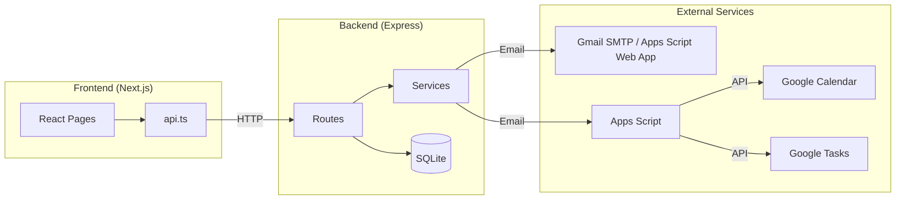
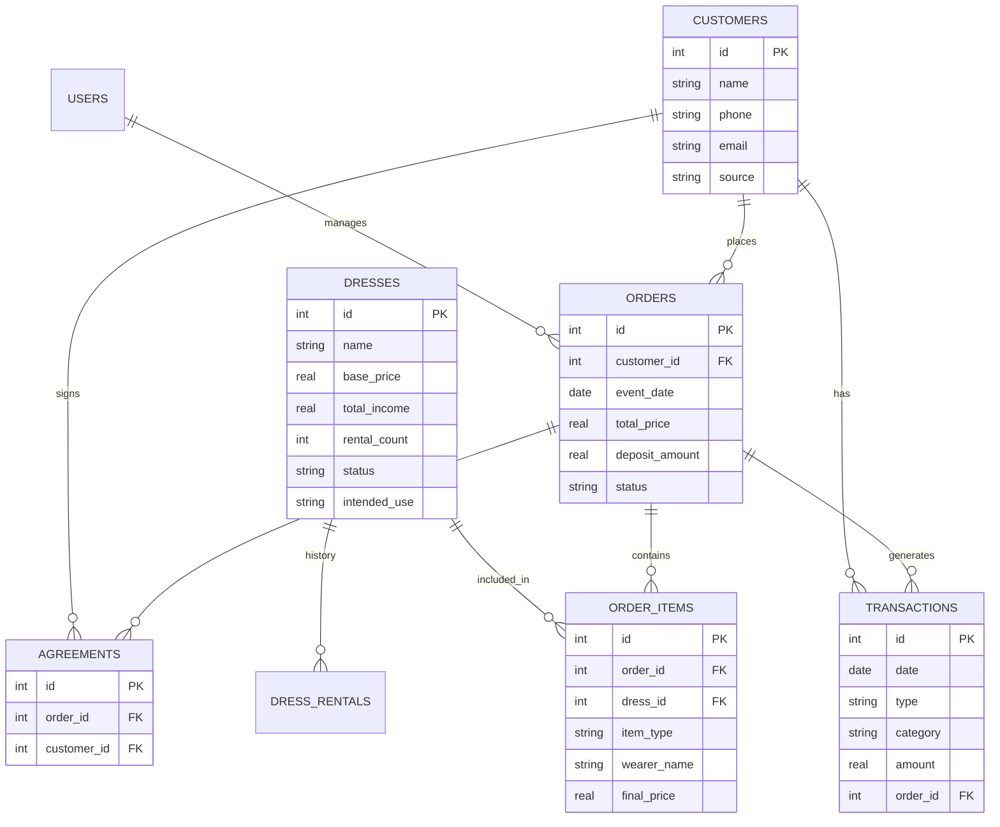

# 🏗️ ARCHITECTURE.md - Dress Rental Business Management

> **Purpose:** Complete architectural guide for AI agents and developers.
> Last Updated: 2026-02-17

---

## 📋 Quick Reference

| What | Location | Description |
|------|----------|-------------|
| Frontend | `frontend/` | Next.js React app |
| Backend | `backend/` | Express.js REST API |
| Database | `local_data/backend_data/business.db` | SQLite (Persistent) |
| DB Schema Reference | `docs/DB-SCHEMA.md` | Authoritative live table schema with PK/FK/constraints + short column purposes |
| Logs | `local_data/logs/` | System & Error logs |
| Google Integration | `apps_script/` | Via Web App POST (instant) |
| API Client | `frontend/src/lib/api.ts` | Centralized fetch wrapper |
| Android Share-In | `frontend/public/sw.js` + `frontend/src/app/share-target/page.tsx` | PWA share target routing into forms |

---

## 💾 Data Persistence & Backup Strategy (CRITICAL)

**The `local_data/` directory is the ONLY location for persistent data.**

*   **Why?** This directory is externally backed up by the user and is ignored by Git (`.gitignore`).
*   **What goes here?**
    *   SQLite Database (`backend_data/business.db`)
    *   Logs (`logs/`)
    *   User Uploads (`uploads/`)
    *   Environment Secrets (`.env`)
    *   CSV Imports (`csv-files-from-google-sheets/`)

**⚠️ NEVER store critical data outside of `local_data/`. Any data outside this folder is considered ephemeral or code.**

---

## 🔄 System Flow Overview



---

## 📊 Database Schema (9 Tables)

**Authoritative reference:** `docs/DB-SCHEMA.md`
- Use that file for exact table/column/PK/FK/constraints/defaults.
- Update it immediately with every schema migration/change.



### Table Purposes:
- **users**: Admin authentication (JWT-based)
- **customers**: Client contact info, source, and history
- **dresses**: Inventory with status tracking and intended use (`rental` / `sale`)
- **dress_history**: Historical event log per dress (rentals, sales, sewing)
- **orders**: Main order records (rental/sewing/sale); status `active` or `cancelled`
- **order_items**: Multiple items per order (multi-dress support); item_type: `rental`, `sewing`, `sewing_for_rental`, `sale`
- **transactions**: All income/expense records; income categories: `order`, `repair`, `other`
- **agreements**: Signed digital agreements (rental, sewing, sale)
- **settings**: System configuration

---

## 🔀 Business Flows

### 1. Order Creation Flow
```
[UI: orders/page.tsx] 
    ↓ ordersApi.create()
[Android Share Menu] → [PWA share_target] → [UI: orders/new]
[Route: POST /api/orders]
    ├── Create/find customer
    ├── Create order record
    ├── Create order_items (multiple dresses)
    ├── Normalize payment reference fields by payment method
    ├── Create deposit transaction(s)
    ├── Update dress rental_count + total_income
    ├── Mark dress as `sold` only when item type is `sale` (rental booking does not make dress unavailable)
    ├── AI receipt extraction if file attached (Gemini with ordered model fallback)
    └── sendNewOrderNotification() → Apps Script Web App (order_notification payload)
```

### 2. Transaction Creation Flow
```
[UI: transactions/page.tsx]
    ↓ transactionsApi.create()
[Android Share Menu] → [PWA share_target] → [UI: transactions/new]
[Route: POST /api/transactions]
    ├── Create/find customer (if income)
    ├── Normalize payment reference fields by payment method
    ├── Create transaction record
    ├── Link to order if order_id provided
    ├── AI receipt extraction if receipt attached (Gemini with ordered model fallback)
    └── sendDetailedIncomeNotification() → Apps Script (income_detailed)
```

### 3. Google Integration Flow (Apps Script)
```
[Backend Service: email.js]
    │
    └── sendToAppsScript(payload)
            ↓ HTTP POST to Apps Script Web App URL
            (No email fallback — VPS has no SMTP; email trigger removed)
    │
[Apps Script: Code.js]
    │
    └── doPost() → processPayload() / handleSendEmail()
            ↓ Sends logs to backend `/api/apps-script-logs/batch`
            │
            └── Handler by type:
                ├── send_email → handleSendEmail() (relay for customer emails)
                ├── calendar_wedding → handleWeddingCalendar()
                ├── task_wedding → handleWeddingTask()
                ├── order_notification → handleOrderNotification()
                │       ├── Send order email to owner (+attachments)
                │       ├── Create wedding calendar event (new order only)
                │       └── Create wedding task in list "לקוחות" (new order only)
                ├── income_detailed → handleIncomeDetailed()
                ├── expense_notification → handleNotificationGeneric()
                └── sheets_append → handleSheetsAppend()
```

---

## 📁 File Structure & Dependencies

### Backend Routes → Services
```
routes/orders.js
    ├── imports: db/database.js (run, get, all)
    ├── imports: middleware/auth.js (requireAuth)
    ├── imports: services/email.js (sendNewOrderNotification, sendToAppsScript)
    └── imports: services/ai.js (extractReceiptDetails)

routes/transactions.js
    ├── imports: db/database.js
    ├── imports: services/email.js
    └── imports: services/localStorage.js

routes/agreements.js
    ├── imports: db/database.js
    ├── imports: services/pdfGenerator.js
    ├── imports: services/email.js
    └── imports: services/localStorage.js
```

### Frontend Pages → API
```
app/dashboard/orders/page.tsx
    └── imports: lib/api.ts (ordersApi, customersApi, dressesApi)

app/dashboard/transactions/page.tsx
    └── imports: lib/api.ts (transactionsApi, customersApi, dressesApi, ordersApi)

app/dashboard/page.tsx
    └── imports: lib/api.ts (dashboardApi)
```

### Service Dependencies
```
services/email.js
    ├── Uses: config/index.js (businessConfig, appsScriptConfig)
    └── Exports: sendToAppsScript, sendNewOrderNotification, sendNewIncomeNotification

services/ai.js
    ├── Uses: Gemini Vision API
    ├── Runtime: calls `models.list` and filters configured model candidates
    └── Exports: extractReceiptDetails (returns { confirmationNumber, lastFourDigits, checkNumber, installments, bankDetails })

## 🤖 AI Model Strategy (Gemini)

- API key: `GEMINI_API_KEY`
- Preferred model order (configurable with `GEMINI_MODEL_CANDIDATES`):
  1. `gemini-3-pro-preview`
  2. `gemini-3-flash-preview`
  3. `gemini-2.5-pro`
  4. `gemini-2.5-flash`
  5. `gemini-2.5-flash-lite`
  6. `gemini-2.0-flash`
  7. `gemini-2.0-flash-lite`
- Behavior:
  - Service fetches `models.list` and keeps a short cache.
  - It tries models in order and falls back only on retryable errors (e.g. 404/429/unavailable).

services/pdfGenerator.js
    ├── Uses: pdfkit, canvas
    └── Exports: generateAgreementPdf
```

---

## 🔌 API Endpoints Summary

### Authentication
| Method | Endpoint | Purpose |
|--------|----------|---------|
| POST | `/api/auth/login` | Login, returns JWT |
| GET | `/api/auth/me` | Get current user |
| POST | `/api/auth/change-password` | Change password |

### Customers
| Method | Endpoint | Purpose |
|--------|----------|---------|
| GET | `/api/customers` | List with search/pagination |
| POST | `/api/customers` | Create new |
| PUT | `/api/customers/:id` | Update |
| DELETE | `/api/customers/:id` | Soft delete |
| GET | `/api/customers/quick-search` | Autocomplete |

### Dresses
| Method | Endpoint | Purpose |
|--------|----------|---------|
| GET | `/api/dresses` | List with filters |
| POST | `/api/dresses/upload` | Upload/process dress image (internal storage) |
| POST | `/api/dresses` | Create new |
| PUT | `/api/dresses/:id` | Update |
| PATCH | `/api/dresses/:id/status` | Update status |
| GET | `/api/dresses/available` | Bookable dresses + future booking details |

### Orders
| Method | Endpoint | Purpose |
|--------|----------|---------|
| GET | `/api/orders` | List with filters |
| POST | `/api/orders` | Create (triggers integrations) |
| PUT | `/api/orders/:id` | Update |
| PATCH | `/api/orders/:id/status` | Update status |
| POST | `/api/orders/:id/payment` | Add payment |

### Transactions
| Method | Endpoint | Purpose |
|--------|----------|---------|
| GET | `/api/transactions` | List with filters |
| POST | `/api/transactions` | Create (triggers notifications) |
| PUT | `/api/transactions/:id` | Update |
| DELETE | `/api/transactions/:id` | Delete |

### Dashboard
| Method | Endpoint | Purpose |
|--------|----------|---------|
| GET | `/api/dashboard/summary` | Stats overview |
| GET | `/api/dashboard/upcoming-events` | Upcoming orders |
| GET | `/api/dashboard/requires-attention` | Items needing action |

### Export
| Method | Endpoint | Purpose |
|--------|----------|---------|
| GET | `/api/export/datasets` | List exportable datasets + recommended filters |
| GET | `/api/export/csv` | Download filtered dataset as CSV |

## ⚙️ Key Services Explained

### email.js - Core Integration Hub
The email service is central to all external integrations:
```javascript
// Main function for Google integration
sendToAppsScript(payload) 
// Sends JSON via email → Apps Script polls and executes

// Payload types:
// - calendar_wedding: Create calendar event
// - task_wedding: Create Google Task
// - notification_income: Forward income notification
// - notification_order: Forward order notification
// - sheets_append: Add to Google Sheets
// - drive_upload: Upload file to Drive
```

### ai.js - Receipt Processing
Extracts structured payment data from payment receipts:
```javascript
extractReceiptDetails(fileBuffer, mimeType)
// Returns: { confirmationNumber, lastFourDigits, checkNumber, installments, bankDetails }
// Uses Gemini Vision
```

---

## 🎯 Common Modification Scenarios

### "Add a new field to orders"
1. `backend/src/db/schema.js` - Add column to createOrdersTable
2. Create migration in `backend/src/db/` for existing DBs
3. `backend/src/routes/orders.js` - Handle in POST/PUT
4. `frontend/src/app/dashboard/orders/page.tsx` - Add to form
5. `frontend/src/lib/api.ts` - Update types if needed

### "Add new Google integration"
1. `backend/src/services/email.js` - Add new sendToAppsScript call
2. `apps_script/Code.js` - Add handler function
3. Add case to processMessage() switch

### "Add new transaction category"
1. Only `backend/src/routes/transactions.js` validation (if any)
2. Frontend category dropdown in transactions page

### "Add new API endpoint"
1. Create route in `backend/src/routes/your-route.js`
2. Mount in `backend/src/index.js`
3. Add API methods in `frontend/src/lib/api.ts`
4. Use in frontend page

---

## 🚀 Deployment Architecture

### Production Environment — Two Deployment Modes

The system supports two deployment modes. Choose one during `setup-new-server.sh`.

#### Option A: Docker Install (Frontend + Backend in Container)

```
┌─────────────────────────────────────────────────────────────────────┐
│  Developer Machine (Local)                                          │
│  ├── Code editing + local dev (npm run dev)                         │
│  ├── git push → GitHub                                              │
│  └── local_data/ (old snapshot, NOT used for business)              │
└─────────────────────┬───────────────────────────────────────────────┘
                      │ Git push
                      ▼
┌─────────────────────────────────────────────────────────────────────┐
│  GitHub (YOUR_GITHUB_USERNAME/YOUR_REPO_NAME)              │
└─────┬───────────────────────────────────────────┬───────────────────┘
      │ Vercel auto-deploy (optional)             │ VPS cron poll (1 min)
      ▼                                           ▼
┌──────────────────────┐    ┌─────────────────────────────────────────┐
│  Vercel (optional)   │    │  VPS (Ubuntu 24.04)                    │
│  Frontend only       │───▶│  Docker Container: business-mgmt-app        │
│                      │    │  ├── Next.js Frontend  :3000            │
│                      │    │  ├── Express Backend   :3001            │
└──────────────────────┘    │  ├── Chromium (PDF generation)          │
                            │  └── Hebrew fonts (Noto, Culmus)        │
                            │                                         │
                            │  Host Services:                         │
                            │  ├── Tailscale Funnel → :3000 (HTTPS)   │
                            │  ├── cron: auto-update.sh (every 1 min) │
                            │  ├── cron: sync-to-cloud.sh (hourly)    │
                            │  └── rclone → Google Drive               │
                            └─────────────────────────────────────────┘
```

#### Option B: Direct Install (Backend via pm2, Frontend on Vercel)

```
┌─────────────────────────────────────────────────────────────────────┐
│  Developer Machine (Local)                                          │
│  ├── Code editing + local dev (npm run dev)                         │
│  ├── git push → GitHub                                              │
│  └── local_data/ (old snapshot, NOT used for business)              │
└─────────────────────┬───────────────────────────────────────────────┘
                      │ Git push
                      ▼
┌─────────────────────────────────────────────────────────────────────┐
│  GitHub (YOUR_GITHUB_USERNAME/YOUR_REPO_NAME)              │
└─────┬───────────────────────────────────────────┬───────────────────┘
      │ Vercel auto-deploy                        │ VPS cron poll (1 min)
      ▼                                           ▼
┌──────────────────────┐    ┌─────────────────────────────────────────┐
│  Vercel              │    │  VPS (Ubuntu 24.04, pm2)               │
│  YOUR_APP_NAME       │    │                                         │
│  .vercel.app         │    │  pm2: dress-backend                     │
│  (Frontend)          │───▶│  ├── Express Backend   :3001            │
│  NEXT_PUBLIC_API_URL │    │  ├── Chromium (system package)          │
│  → VPS backend       │    │  └── Hebrew fonts (system packages)     │
└──────────────────────┘    │                                         │
                            │  Host Services:                         │
                            │  ├── Tailscale Funnel → :3001 (HTTPS)   │
                            │  ├── cron: auto-update-direct.sh (1 min)│
                            │  ├── cron: sync-to-cloud.sh (hourly)    │
                            │  └── rclone → Google Drive               │
                            └─────────────────────────────────────────┘
```

### URLs

| URL | Purpose | Who Uses It |
|-----|---------|-------------|
| `https://YOUR_APP_NAME.vercel.app` | Main app entry (clean URL) | Business owner, customers (agreements) |
| `https://your-vps.YOUR_TAILSCALE_DOMAIN.ts.net` | Direct VPS access (Tailscale) | Technical access, API calls from Vercel |
| `https://YOUR_APP_NAME.vercel.app/agreement?token=...` | Customer agreement signing | Customers (sent via WhatsApp) |

### Docker Configuration (Docker Install only)

- **Dockerfile**: Multi-stage build (builder + runtime), installs Chromium + Hebrew fonts
- **docker-compose.yml**: `network_mode: host`, mounts `./local_data`, `restart: always`
- **entrypoint.sh**: Starts backend and frontend, handles graceful shutdown
- **Environment**: `CHROME_BIN=/usr/bin/chromium`, `NODE_ENV=production`

### Direct Install Configuration (Direct Install only)

- **pm2-ecosystem.config.js**: pm2 config for backend process (`dress-backend`)
- **start-backend.sh**: Startup wrapper that waits for port 3001 before launching Node
- **wait-for-port.sh**: Utility that blocks until a TCP port is free
- **start-app.sh**: Creates directories, runs migrations, starts pm2
- **setup-direct-install.sh**: Installs Node.js 20, Chromium, fonts, build tools
- **Environment**: `CHROME_BIN=/usr/bin/chromium-browser`, `NODE_ENV=production`

### Auto-Update Flow

#### Docker Mode (`auto-update.sh`)
```
cron (every 1 min) → auto-update.sh
    ├── git fetch origin master
    ├── Compare local HEAD vs remote HEAD
    ├── If different:
    │   ├── sync-to-cloud.sh (safety backup)
    │   ├── git pull origin master
    │   ├── docker compose up -d --build --force-recreate
    │   └── Health check
    └── If same: exit silently
```

#### Direct Install Mode (`auto-update-direct.sh`)
```
cron (every 1 min) → auto-update-direct.sh
    ├── git fetch origin master
    ├── Compare local HEAD vs remote HEAD
    ├── If different:
    │   ├── sync-to-cloud.sh (safety backup)
    │   ├── git pull origin master
    │   ├── cd backend && npm install
    │   ├── pm2 stop → wait for port → pm2 start
    │   └── Health check (retries up to 60s)
    └── If same: exit silently
```

### Backup Flow

```
cron (hourly) → sync-to-cloud.sh
    ├── sqlite3 PRAGMA wal_checkpoint(TRUNCATE)  (consistency)
    └── rclone sync local_data/ → gdrive:YOUR_REPO_NAME/
        (excludes: logs/, *.db-wal, *.db-shm, migration_backups/)
```

### Key VPS Paths

| Path | Purpose |
|------|---------|
| `/root/YOUR_REPO_NAME/` | Project root (Git clone) |
| `/root/YOUR_REPO_NAME/local_data/` | All persistent data |
| `/root/YOUR_REPO_NAME/local_data/.env` | Secrets |
| `/root/YOUR_REPO_NAME/local_data/backend_data/business.db` | Database |
| `/root/YOUR_REPO_NAME/local_data/logs/` | App + sync + update logs |
| `/root/.config/rclone/rclone.conf` | Google Drive rclone auth |

---

## 📌 Important Notes

1. **Language Convention**:
   - Code & documentation: English
   - UI text & data: Hebrew

2. **Authentication**:
   - JWT tokens stored in localStorage
   - `requireAuth` middleware on all protected routes

3. **File Uploads**:
   - Receipts: `uploads/receipts/`
   - Signatures: `uploads/signatures/`
   - Dress images: uploaded directly and stored in `uploads/dresses/`
   - Dress image fields (`photo_url`, `thumbnail_url`) store internal app paths (`/uploads/dresses/...`) only
   - Receipts can also arrive via base64 handoff from Android share flow

4. **Google Integration**:
   - PRIMARY: Instant via Web App POST (set `APPS_SCRIPT_WEB_APP_URL` in `.env`)
   - Email sending routes through Apps Script Web App (bypasses SMTP)

5. **Dress Availability Semantics**:
   - Future bookings are shown as scheduling information, not hard unavailability
   - Dresses are excluded from booking flow only when status is `sold` or `retired`

6. **Agreement Link Configuration**:
   - Customer-facing agreement links use `FORCED_PUBLIC_FRONTEND_URL` in `backend/src/routes/agreements.js`
   - Currently set to `https://YOUR_APP_NAME.vercel.app` for clean URLs
   - Can be overridden by `PUBLIC_FRONTEND_URL` env var

7. **VPS is Source of Truth**:
   - Only one backend should process real business data at a time
   - The VPS database is the authoritative copy
   - Local development should use test data or a snapshot
   - Google Drive backup path for VPS: `gdrive:YOUR_REPO_NAME/`
   - Google Drive backup path for local machine (legacy): `gdrive:YOUR_BACKUP_FOLDER/`
