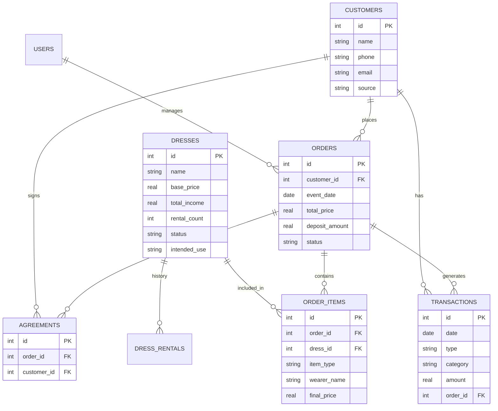

# 🏗️ ARCHITECTURE.md - Dress Rental Business Management

> **Purpose:** Complete architectural guide for AI agents and developers.
> Last Updated: 2026-02-25

---

## 📋 Quick Reference

| What | Location | Description |
|------|----------|-------------|
| Frontend | `frontend/` | Next.js React app |
| Backend | `backend/` | Express.js REST API |
| Database | `local_data/backend_data/backend_data.db` | SQLite (Persistent) |
| DB Schema Reference | `docs/DB-SCHEMA.md` | Authoritative live table schema with PK/FK/constraints + short column purposes |
| Logs | `local_data/logs/` | System & Error logs |
| Google Integration | `apps_script/` | Via Web App POST (instant) |
| API Client | `frontend/src/lib/api.ts` | Centralized fetch wrapper |
| Android Share-In | `frontend/public/sw.js` + `frontend/src/app/share-target/page.tsx` | PWA share target routing into forms |

---

## 💾 Data Persistence & Backup Strategy (CRITICAL)

**The `local_data/` directory is the ONLY location for persistent data.**

*   **Why?** This directory is externally backed up by the user and is ignored by Git (`.gitignore`).
*   **What goes here?**
    *   SQLite Database (`backend_data/backend_data.db`)
    *   Logs (`logs/`)
    *   User Uploads (`uploads/`)
        - `uploads/signatures/` — raw signature images from digital agreement signing
        - `uploads/agreements/` — signed agreement PDFs (one sub-folder per customer/date)
        - `uploads/dresses/` — dress images (WebP + thumbnails via `sharp`)
        - `uploads/expenses/` — expense receipt files, organized as `YEAR/CATEGORY/YYMMDD [supplier] [description] [amount]₪.ext`
    *   Environment Secrets (`.env`)
    *   CSV Imports (`csv/`) — source data files exported from Google Sheets

**⚠️ NEVER store critical data outside of `local_data/`. Any data outside this folder is considered ephemeral or code.**

---

## 🔄 System Flow Overview

```mermaid
graph LR
    subgraph Frontend ["Frontend (Next.js)"]
        UI[React Pages]
        API_CLIENT[api.ts]
    end
    
    subgraph Backend ["Backend (Express)"]
        ROUTES[Routes]
        SERVICES[Services]
        DB[(SQLite)]
    end
    
    subgraph External ["External Services"]
        APPS[Apps Script Web App]
        GMAIL[Gmail (GmailApp)]
        GCAL[Google Calendar]
        GTASK[Google Tasks]
        GDRIVE[Google Drive / Tasks API]
    end

    UI --> API_CLIENT
    API_CLIENT -->|HTTP| ROUTES
    ROUTES --> SERVICES
    ROUTES --> DB
    SERVICES -->|HTTPS POST| APPS
    APPS -->|GmailApp| GMAIL
    APPS -->|API| GCAL
    APPS -->|API| GTASK
    APPS -->|API| GDRIVE
```

---

## 📊 Database Schema (9 Tables)

**Authoritative reference:** `docs/DB-SCHEMA.md`
- Use that file for exact table/column/PK/FK/constraints/defaults.
- Update it immediately with every schema migration/change.


```mermaid
erDiagram
    USERS ||--o{ ORDERS : manages
    CUSTOMERS ||--o{ ORDERS : places
    CUSTOMERS ||--o{ TRANSACTIONS : has
    CUSTOMERS ||--o{ AGREEMENTS : signs
    DRESSES ||--o{ DRESS_RENTALS : history
    DRESSES ||--o{ ORDER_ITEMS : included_in
    ORDERS ||--o{ ORDER_ITEMS : contains
    ORDERS ||--o{ TRANSACTIONS : generates
    ORDERS ||--o{ AGREEMENTS : has
    
    CUSTOMERS {
        int id PK
        string name
        string phone
        string email
        string source
    }
    
    DRESSES {
        int id PK
        string name
        real base_price
        real total_income
        int rental_count
        string status
        string intended_use
    }
    
    ORDERS {
        int id PK
        int customer_id FK
        date event_date
        real total_price
        real deposit_amount
        string status
    }
    
    ORDER_ITEMS {
        int id PK
        int order_id FK
        int dress_id FK
        string item_type
        string wearer_name
        real final_price
    }
    
    TRANSACTIONS {
        int id PK
        date date
        string type
        string category
        real amount
        int order_id FK
    }
    
    AGREEMENTS {
        int id PK
        int order_id FK
        int customer_id FK
    }
```

### Table Purposes:
- **users**: Admin authentication (JWT-based)
- **customers**: Client contact info, source, and history
- **dresses**: Inventory with status tracking (`available` / `sold` / `retired` / `custom_sewing`) and optional intended use (`rental` / `sale` / empty)
- **dress_history**: Historical event log per dress (rentals, sales, sewing)
- **orders**: Main order records (rental/sewing/sale); DB status `active` or `cancelled`. The UI further splits `active` into `פתוחה` (open — balance non-zero or future event) and `הושלמה` (completed — event passed and balance = 0) via a computed helper.
- **order_items**: Multiple items per order (multi-dress support); item_type: `rental`, `sewing`, `sewing_for_rental`, `sale`
- **transactions**: All income/expense records; income categories: `order`, `repair`, `other`
- **agreements**: Signed digital agreements (rental, sewing, sale)
- **settings**: System configuration

---

## 🔀 Business Flows

### 1. Order Creation Flow
```
[UI: orders/page.tsx] 
    ↓ ordersApi.create()
[Android Share Menu] → [PWA share_target] → [UI: orders/new]
[Route: POST /api/orders]
    ├── Create/find customer
    ├── Create order record
    ├── Create order_items (multiple dresses)
    ├── Normalize payment reference fields by payment method
    ├── Create deposit transaction(s)
    ├── Update dress rental_count + total_income
    ├── Mark dress as `sold` only when item type is `sale` (rental booking does not make dress unavailable)
    ├── AI receipt extraction if file attached (Gemini with ordered model fallback)
    └── sendNewOrderNotification() → Apps Script Web App (order_notification payload)
```

### 2. Transaction Creation Flow
```
[UI: transactions/page.tsx]
    ↓ transactionsApi.create()
[Android Share Menu] → [PWA share_target] → [UI: transactions/new]
[Route: POST /api/transactions]
    ├── Create/find customer (if income)
    ├── Normalize payment reference fields by payment method
    ├── Create transaction record
    ├── Link to order if order_id provided
    ├── recomputeOrderPaidAmount(order_id) — recalculate orders.paid_amount from SUM of income transactions
    ├── AI receipt extraction if receipt attached (Gemini with ordered model fallback)
    └── sendDetailedIncomeNotification() → Apps Script (income_detailed)

[Route: PUT /api/transactions/:id]
    ├── Update transaction record
    └── recomputeOrderPaidAmount(old_order_id + new_order_id) — keeps order balance in sync

[Route: DELETE /api/transactions/:id]
    └── recomputeOrderPaidAmount(order_id) — removes contribution from order balance
```

### 2b. Order Edit / Cancel Flow
```
[Route: PUT /api/orders/:id]
    ├── Look up customer name (for dress_history.customer_name snapshot)
    ├── UPDATE orders record (status, items, dates, prices…)
    ├── If status → cancelled:
    │       └── removeOrderDressHistory(id) — deletes order's dress_history rows,
    │                                          recomputes total_income + rental_count per dress
    └── If items provided AND status != cancelled:
            ├── DELETE old order_items
            ├── INSERT new order_items
            ├── Sync dress sale-status for sale-type items
            ├── UPDATE order_summary
            ├── DELETE dress_history WHERE order_id = id
            ├── INSERT new dress_history rows from new items (amount = final_price)
            └── recomputeDressIncomeAndCount(dressId) for every affected dress

[Route: DELETE /api/orders/:id]   (soft-cancel)
    ├── removeOrderDressHistory(id) — strips order's contribution from all dress history/aggregates
    ├── UPDATE orders SET status = 'cancelled'
    └── syncDressSaleStatus for dresses that had sale-type items
```

### 3. Google Integration Flow (Apps Script)
```
[Backend Service: email.js]
    │
    └── sendToAppsScript(payload)
            ↓ HTTP POST to Apps Script Web App URL
            (No email fallback — VPS has no SMTP; email trigger removed)
    │
[Apps Script: Code.js]
    │
    └── doPost() → processPayload() / handleSendEmail()
            ↓ Sends logs to backend `/api/apps-script-logs/batch`
            │
            └── Handler by type:
                ├── send_email → handleSendEmail() (relay for customer emails)
                ├── calendar_wedding → handleWeddingCalendar()
                ├── task_wedding → handleWeddingTask()
                ├── order_notification → handleOrderNotification()
                │       ├── Send order email to owner (+attachments)
                │       ├── Create wedding calendar event (new order only)
                │       └── Create wedding task in list "לקוחות" (new order only)
                ├── income_detailed → handleIncomeDetailed()
                ├── expense_notification → handleNotificationGeneric()
                └── sheets_append → handleSheetsAppend()
```

---

## 📁 File Structure & Dependencies

### Backend Routes → Services
```
routes/orders.js
    ├── imports: db/database.js (run, get, all)
    ├── imports: middleware/auth.js (requireAuth)
    ├── imports: services/email.js (sendNewOrderNotification, sendToAppsScript)
    └── imports: services/ai.js (extractReceiptDetails)

routes/transactions.js
    ├── imports: db/database.js
    ├── imports: services/email.js
    └── imports: services/localStorage.js

routes/agreements.js
    ├── imports: db/database.js
    ├── imports: services/pdfGenerator.js
    ├── imports: services/email.js
    └── imports: services/localStorage.js
```

### Frontend Pages → API
```
app/dashboard/orders/page.tsx
    └── imports: lib/api.ts (ordersApi, customersApi, dressesApi)

app/dashboard/transactions/page.tsx
    └── imports: lib/api.ts (transactionsApi, customersApi, dressesApi, ordersApi)

app/dashboard/page.tsx
    └── imports: lib/api.ts (dashboardApi)
```

### Service Dependencies
```
services/email.js
    ├── Transport: HTTPS POST to Apps Script Web App (no SMTP / nodemailer)
    ├── Uses: config/index.js (appsScriptConfig, businessConfig)
    └── Exports: isEmailEnabled, sendToAppsScript, sendNewOrderNotification,
                 sendNewIncomeNotification, sendNewExpenseNotification,
                 sendDetailedIncomeNotification, sendAgreementConfirmationToCustomer,
                 sendAgreementNotificationToOwner, sendCalendarEvent, sendTaskToGoogle,
                 sendFileToDrive, sendDriveRename, sendOrderUpdate, sendToEmailList,
                 testEmailConnection

services/ai.js
    ├── Uses: Gemini Vision API
    ├── Runtime: calls `models.list` and filters configured model candidates
    └── Exports: extractReceiptDetails (returns { confirmationNumber, lastFourDigits, checkNumber, installments, bankDetails })

## 🤖 AI Model Strategy (Gemini)

- API key: `GEMINI_API_KEY`
- Preferred model order (configurable with `GEMINI_MODEL_CANDIDATES`):
  1. `gemini-3-flash-preview`
  2. `gemini-3.1-flash-lite-preview`
  3. `gemini-2.5-flash`
  4. `gemini-2.5-flash-lite`
- Behavior:
  - Service fetches `models.list` and keeps a short cache.
  - It tries models in order and falls back only on retryable errors (e.g. 404/429/unavailable).

services/pdfGenerator.js
    ├── Uses: pdfkit, canvas
    └── Exports: generateAgreementPdf
```

---

## 🔌 API Endpoints Summary

### Authentication
| Method | Endpoint | Purpose |
|--------|----------|---------|
| POST | `/api/auth/login` | Login, returns JWT |
| GET | `/api/auth/me` | Get current user |
| POST | `/api/auth/change-password` | Change password |

### Customers
| Method | Endpoint | Purpose |
|--------|----------|---------|
| GET | `/api/customers` | List with search/pagination |
| POST | `/api/customers` | Create new |
| PUT | `/api/customers/:id` | Update |
| POST | `/api/customers/merge` | Merge two customers; source deleted, history transferred to target |
| GET | `/api/customers/quick-search` | Autocomplete |

> **Note**: There is no `DELETE /api/customers/:id` — customers are never individually deleted. Use `POST /api/customers/merge` to consolidate duplicates.

### Dresses
| Method | Endpoint | Purpose |
|--------|----------|---------|
| GET | `/api/dresses` | List with filters |
| POST | `/api/dresses/upload` | Upload/process dress image (internal storage) |
| POST | `/api/dresses` | Create new |
| PUT | `/api/dresses/:id` | Update |
| PATCH | `/api/dresses/:id/status` | Update status |
| GET | `/api/dresses/available` | Bookable dresses + future booking details |
| GET | `/api/dresses/:id` | Single dress with rental history + stats |
| POST | `/api/dresses/merge` | Merge two dresses; source deleted, history transferred to target |
| POST | `/api/dresses/:id/rental` | Add manual rental record to dress history |

> **Note**: There is no `DELETE /api/dresses/:id` — dresses are never individually deleted. Use `POST /api/dresses/merge` to consolidate duplicates.


### Orders
| Method | Endpoint | Purpose |
|--------|----------|---------|
| GET | `/api/orders` | List with filters |
| POST | `/api/orders` | Create (triggers integrations) |
| PUT | `/api/orders/:id` | Update |
| PATCH | `/api/orders/:id/status` | Update status |
| POST | `/api/orders/:id/payment` | Add payment |

### Transactions
| Method | Endpoint | Purpose |
|--------|----------|---------|
| GET | `/api/transactions` | List with filters |
| POST | `/api/transactions` | Create (triggers notifications) |
| PUT | `/api/transactions/:id` | Update |
| DELETE | `/api/transactions/:id` | Delete |

### Dashboard
| Method | Endpoint | Purpose |
|--------|----------|---------|
| GET | `/api/dashboard/summary` | Stats overview |
| GET | `/api/dashboard/upcoming-events` | Upcoming orders |
| GET | `/api/dashboard/requires-attention` | Items needing action |

### Export
| Method | Endpoint | Purpose |
|--------|----------|---------|
| GET | `/api/export/datasets` | List exportable datasets + recommended filters |
| GET | `/api/export/csv` | Download filtered dataset as CSV |

## ⚙️ Key Services Explained

### email.js - Core Integration Hub
The email service is central to all external integrations. It has a single
transport: HTTPS POST to the Apps Script Web App (no SMTP / nodemailer).
If `APPS_SCRIPT_WEB_APP_URL` is not configured, calls fail loudly (logged
as errors) — there is no email-polling fallback.

```javascript
// Main function for Google integration
sendToAppsScript(payload)
// Sends JSON via HTTPS POST → Apps Script doPost → processPayload(payload)

// Payload types (matched in apps_script/Code.js processPayload switch):
// - calendar_wedding   : Create wedding calendar event
// - task_wedding       : Create wedding Google Task
// - calendar           : Generic calendar event
// - task               : Generic task
// - sheets             : Append row to Google Sheets
// - drive              : Upload file to Drive
// - drive_rename       : Rename/move a Drive file
// - income_notification / income_detailed : Income emails (handleIncomeDetailed)
// - expense_notification: Expense email (handleNotificationGeneric)
// - order_notification : Order email + auto-create wedding calendar/task
// - order_update       : Sync renamed/rescheduled wedding calendar event + task
// - send_email         : Relay arbitrary email via GmailApp (used for agreements)
```

### ai.js - Receipt Processing
Extracts structured payment data from payment receipts:
```javascript
extractReceiptDetails(fileBuffer, mimeType)
// Returns: { confirmationNumber, lastFourDigits, checkNumber, installments, bankDetails }
// Uses Gemini Vision
```

---

## 🎯 Common Modification Scenarios

### "Add a new field to orders"
1. `backend/src/db/schema.js` - Add column to createOrdersTable
2. Create migration in `backend/src/db/` for existing DBs
3. `backend/src/routes/orders.js` - Handle in POST/PUT
4. `frontend/src/app/dashboard/orders/page.tsx` - Add to form
5. `frontend/src/lib/api.ts` - Update types if needed

### "Add new Google integration"
1. `backend/src/services/email.js` - Add new sendToAppsScript call
2. `apps_script/Code.js` - Add handler function
3. Add case to `processPayload()` switch in `apps_script/Code.js`

### "Add new transaction category"
1. Only `backend/src/routes/transactions.js` validation (if any)
2. Frontend category dropdown in transactions page

### "Add new API endpoint"
1. Create route in `backend/src/routes/your-route.js`
2. Mount in `backend/src/index.js`
3. Add API methods in `frontend/src/lib/api.ts`
4. Use in frontend page

---

## 🚀 Deployment Architecture

### Production Environment

**Deployment:** Backend via pm2 (Direct Install), frontend on Vercel. Port 3001 exposed via nginx reverse proxy with Let's Encrypt SSL on `YOUR-VPS-IP-WITH-DASHES.sslip.io`.

```
┌─────────────────────────────────────────────────────────────────────┐
│  Developer Machine (Local)                                          │
│  ├── Code editing + local dev (npm run dev)                         │
│  ├── git push → GitHub                                              │
│  └── local_data/ (old snapshot, NOT used for business)              │
└─────────────────────┬───────────────────────────────────────────────┘
                      │ Git push
                      ▼
┌─────────────────────────────────────────────────────────────────────┐
│  GitHub (YOUR_GITHUB_USERNAME/YOUR_REPO_NAME)              │
└─────┬───────────────────────────────────────────┬───────────────────┘
      │ Vercel auto-deploy                        │ VPS cron poll (1 min)
      ▼                                           ▼
┌──────────────────────┐    ┌─────────────────────────────────────────┐
│  Vercel              │    │  VPS (YOUR_VPS_IP, Ubuntu 24.04)       │
│  your-app-name.vercel.app│    │                                         │
│  (Frontend only)     │───▶│  Backend (pm2) :3001                    │
│  NEXT_PUBLIC_API_URL │    │  ├── Express Backend                    │
│  → VPS backend       │    │  ├── Chromium (PDF generation)          │
└──────────────────────┘    │  └── Hebrew fonts (Noto, Culmus)        │
                            │                                         │
                            │  Host Services:                         │
                            │  ├── nginx :80/:443 → :3001 (HTTPS)     │
                            │  │   (YOUR-VPS-IP-WITH-DASHES.sslip.io, LE cert)   │
                            │  ├── cron: auto-update-direct.sh (1 min)│
                            │  ├── cron: sync-to-cloud.sh (hourly)    │
                            │  ├── cron: backup-to-telegram.sh (03:00)│
                            │  ├── cron: daily-security-report (23:55)│
                            │  └── rclone → Google Drive               │
                            │                                         │
                            │  Persistent Data (./local_data):        │
                            │  ├── .env (secrets)                     │
                            │  ├── backend_data/backend_data.db       │
                            │  ├── uploads/                           │
                            │  │   ├── signatures/ (PNG files)        │
                            │  │   ├── agreements/ (signed PDFs)      │
                            │  │   ├── dresses/ (WebP images)         │
                            │  │   └── expenses/ (YEAR/CATEGORY/)     │
                            │  ├── logs/                              │
                            │  └── csv/ (Google Sheets exports)       │
                            └─────────────────────────────────────────┘

### URLs

| URL | Purpose | Who Uses It |
|-----|---------|-------------|
| `https://your-app-name.vercel.app` | Main app entry (clean URL) | Business owner, customers (agreements) |
| `https://YOUR-VPS-IP-WITH-DASHES.sslip.io` | Direct VPS backend access (nginx + Let's Encrypt) | Technical access, API calls from Vercel |
| `https://your-app-name.vercel.app/agreement?token=...` | Customer agreement signing | Customers (sent via WhatsApp) |

### Direct Install Configuration

- **pm2-ecosystem.config.js**: pm2 config for backend; invokes `start-backend.sh`
- **start-backend.sh**: Waits for port 3001 free, then execs node (prevents EADDRINUSE on restart)
- **start-app.sh**: Creates dirs, runs migrate, pm2 start
- **auto-update-direct.sh**: git pull → npm install → pm2 restart (no frontend build)
- **Environment**: `CHROME_BIN=/usr/bin/chromium`, `NODE_ENV=production`

### Auto-Update Flow

`auto-update-direct.sh` → git pull → npm install → pm2 restart dress-backend

### Backup Flow

```
cron (hourly) → sync-to-cloud.sh
    ├── sqlite3 PRAGMA wal_checkpoint(TRUNCATE)  (consistency)
    ├── rclone sync local_data/ → gdrive:YOUR_REPO_NAME/
    │   (excludes: logs/, *.db-wal, *.db-shm, migration_backups/)
    └── on failure → send_telegram() via telegram-notify.sh

cron (daily 03:00) → backup-to-telegram.sh
    ├── sqlite3 PRAGMA wal_checkpoint(TRUNCATE)  (consistency)
    ├── curl POST Telegram sendDocument → eti-business-YYYY-MM-DD.db
    └── on failure → send_telegram() alert
```

### Telegram Monitoring Flow

```
Backend (Express)
    └── logger.js [ERROR level]
            └── sendTelegramAlert()   (fire-and-forget, rate-limited)
                    └── Telegram Bot API → group chat

cron (daily 23:55) → daily-security-report.sh
    ├── parse local_data/logs/YYYY-MM-DD.log
    ├── count: login_failed, [401], [403], [WARN]
    └── if any events found → send_telegram summary (otherwise silent)
```

**Alert tiers:**
- Real-time: backend ERROR-level events (crashes, DB errors, unhandled exceptions)
- Real-time: cron script failures (Google Drive backup, Telegram backup)
- Daily summary (23:55): failed logins, 401/403 access attempts (only if any occurred)
- Log-only: normal operations, successful logins, routine requests

### Key VPS Paths

| Path | Purpose |
|------|---------|
| `/root/dress-rental-business-management/` | Project root (Git clone) |
| `/root/dress-rental-business-management/local_data/` | All persistent data |
| `/root/dress-rental-business-management/local_data/.env` | Secrets |
| `/root/dress-rental-business-management/local_data/backend_data/backend_data.db` | Database |
| `/root/dress-rental-business-management/local_data/uploads/signatures/` | Raw signature PNGs |
| `/root/dress-rental-business-management/local_data/uploads/agreements/` | Signed agreement PDFs |
| `/root/dress-rental-business-management/local_data/uploads/dresses/` | Dress images (WebP) |
| `/root/dress-rental-business-management/local_data/uploads/expenses/` | Expense receipts by year/category |
| `/root/dress-rental-business-management/local_data/logs/` | App + sync + update logs |
| `/root/dress-rental-business-management/local_data/csv/` | Source CSV files from Google Sheets |
| `/root/.config/rclone/rclone.conf` | Google Drive rclone auth |

---

## 📌 Important Notes

1. **Language Convention**:
   - Code & documentation: English
   - UI text & data: Hebrew

2. **Authentication**:
   - JWT tokens stored in localStorage
   - `requireAuth` middleware on all protected routes

3. **File Uploads**:
   - Signatures: `uploads/signatures/` → raw PNG from signing pad
   - Agreements: `uploads/agreements/[CustomerName - YYYY-MM-DD - OrderId]/הסכם השכרה - Name.pdf`
   - Dress images: `uploads/dresses/<uuid>.webp` + `<uuid>_thumb.webp` (processed by `sharp`)
   - Dress image fields (`photo_url`, `thumbnail_url`) store internal app paths (`/uploads/dresses/...`) only
   - Expense receipts: `uploads/expenses/[YEAR]/[CATEGORY]/[YYMMDD] [supplier] [description] [amount]₪.[ext]`
   - Income receipt files are **NOT** saved to disk — they are sent to Gemini for AI extraction and then discarded; only structured data (confirmationNumber, lastFourDigits, etc.) is persisted in the `transactions` table
   - Order attachments: `uploads/order_attachments/<orderId>/<uuid>.<ext>` (multipart, multer memory storage). **Image files** are auto-compressed client-side before upload (max 2400px long-side, JPEG q=0.92) via `compressImageFileForAttachment` in `frontend/src/lib/shared-upload.ts`; PDFs and other non-image files pass through unchanged. Per-file backend limit: 20MB. Batches >3MB (or any single file >2MB) are split into sequential per-file POSTs by `ordersApi.uploadAttachment` to stay under the Vercel rewrite proxy's ~4.5MB body limit.

4. **Google Integration**:
   - SOLE TRANSPORT: HTTPS POST to the Apps Script Web App (set `APPS_SCRIPT_WEB_APP_URL` in `.env`)
   - If `APPS_SCRIPT_WEB_APP_URL` is missing, the call returns `{ success: false }` and the error is logged — there is no fallback (email-polling was removed in v0.9.0)
   - Email sending also routes through the same Web App (`type: 'send_email'` handled by `handleSendEmail` → `GmailApp.sendEmail`); the backend itself has no SMTP/nodemailer code

5. **Dress Availability Semantics**:
  - Future bookings are shown as scheduling information, not hard unavailability
  - Only dresses with status `available` are included in booking flow

6. **Agreement Link Configuration**:
   - Customer-facing agreement links use `FORCED_PUBLIC_FRONTEND_URL` in `backend/src/routes/agreements.js`
   - Currently set to `https://your-app-name.vercel.app` for clean URLs
   - Can be overridden by `PUBLIC_FRONTEND_URL` env var

7. **VPS is Source of Truth**:
   - Only one backend should process real business data at a time
   - The VPS database is the authoritative copy
   - Local development should use test data or a snapshot
   - Google Drive backup path for VPS: `gdrive:YOUR_REPO_NAME/`
   - Google Drive backup path for local machine (legacy): `gdrive:YOUR_BACKUP_FOLDER/`
